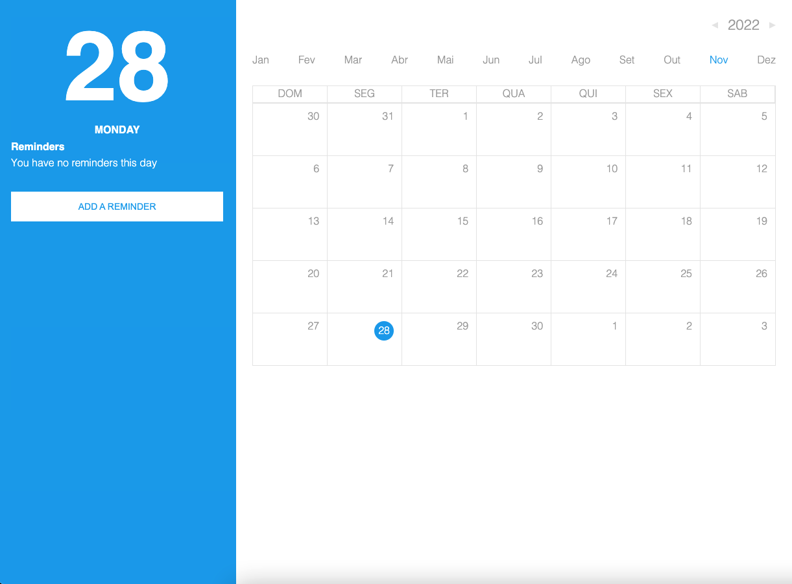

<p align="center">
  <div align="center">
    
</div>
</p>

<h1 align="center">React Challenge - Reminder Calendar App</h1>



<div align="center">

This project is designed to test my knowledge of front-end web technologies and assess my ability to create front-​end UI products with attention to details, cross-browser compatibility, standards, and reusability.

</div>

## ✨ Features

- Complete Styled Calendar.
- CRUD Reminder.
  - AccuWeather integration

## 🖥 Environment Support

- Modern browsers

| [](http://godban.github.io/browsers-support-badges/)<br>Edge | [](http://godban.github.io/browsers-support-badges/)<br>Firefox | [](http://godban.github.io/browsers-support-badges/)<br>Chrome | [](http://godban.github.io/browsers-support-badges/)<br>Safari |
| ---------------------------------------------------------------------------------------------------------------------------------------------------------------------------------------------------- | ---------------------------------------------------------------------------------------------------------------------------------------------------------------------------------------------------------------- | ------------------------------------------------------------------------------------------------------------------------------------------------------------------------------------------------------------ | ------------------------------------------------------------------------------------------------------------------------------------------------------------------------------------------------------------ |
| Edge                                                                                                                                                                                                 | last 2 versions                                                                                                                                                                                                  | last 2 versions                                                                                                                                                                                              | last 2 versions                                                                                                                                                                                              |

## 📦 Running Locally

First, Install the node_modules

```bash
$ npm install
```

Or

```bash
$ yarn
```

Create the environment variables file (.env) and fill them

```bash
$ cp .env.example .env
```

```
REACT_APP_ACCUWEATHER_API_KEY=
```

Then,

```bash
$ npm start
```

Or

```bash
$ yarn start
```

Finally, open your browser and visit http://localhost:8080/

## ⌨️ Development

- Conventional Commits - This repo uses [conventional commits](https://www.conventionalcommits.org/en/v1.0.0-beta.3/) to standardize commit messages and auto generate a changelog throughout the development cycle.
- Atomic Design - This repo uses [atomic design](https://bradfrost.com/blog/post/atomic-web-design/) to standardize the components structure.
- Webpack - This repo is built by [Webpack](https://webpack.js.org/).
- React Hook Form - This repo uses [React Hook Form](https://react-hook-form.com/) in order to handle with forms.
- AccuWeather - This repo uses [AccuWeather API](https://developer.accuweather.com/) to get city forecasts.

## 🤝 Contributing

<table>
  <tr>
    <td align="center">
      <br />      
      <sub>
        <b>Leonardo Arruda</b>
      </sub>      
      <br />
    </td>
  </tr>
</table>

Follow me on <a href="https://github.com/LeonardoArrudaMesquita">Github</a> and <a href="https://www.linkedin.com/in/leonardo-arruda-40053b146/">Linkedin</a>!
